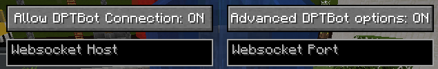
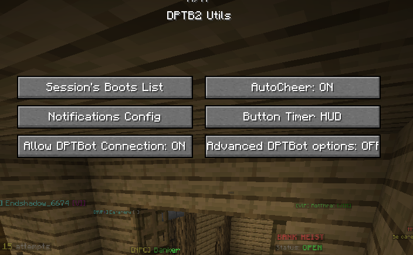
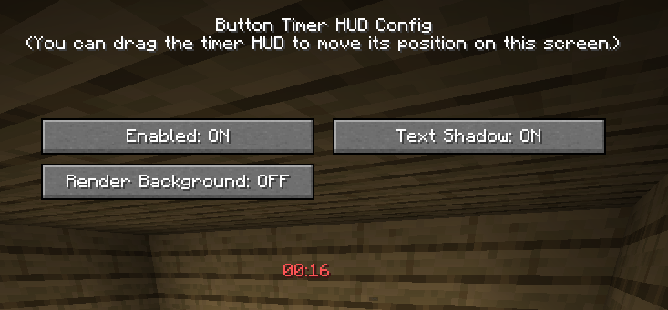

# DPTB2 Utils
An utility mod for the Hypixel Housing game **Don't Press The Button 2**

### Current supported versions:
- Forge 1.8.9
- Fabric 1.21.4
- Fabric 1.21.7

# Features
- **AutoCheer**: Automatically cheers when a community goal is reached.
- **Micro-event Notifications**: Notifies you when these events happen:
    - Shop Update: Rotating Shop reset.
    - Boots Acquisition: Someone got a rare boots with the announcement in chat.
    - City Door Switch: When City's random door switches.
    - Button Mayhem: No button cooldown for 10s.
    - Button Disabled: Button is disabled for 5s.
    - Button Immunity: Next person to press the button will not die.
- **Boots Tracker**: Tracks the boots players have acquired in your current session.
- **Button Timer**: HUD timer that shows how long ago the button was last pressed.
- **DPTBot Integration**: Integrates with the DPTBot Discord bot for the VI+ discord's Chat Ramp:
    - Use `/broadcast` (or `/bc`) command to broadcast a message to everyone connected to DPTBot.
    - Enable the "DPTBot Connection" option in the mod menu to connect to the bot when you join the DPTB2 housing.
- More coming soon...

## Advanced DTPBot options
- When enabled, 2 textboxes will appear in the mod menu screen.
- They are the **DPTBot Server Host** and **DPTBot Server Port** that the mod connects to.
- Do not change them unless told otherwise.



# Usage:
Run `/dptb2` in the chat to open the mod menu.





# Installation
### Pre-built package
You can find and download the latest stable release [here](https://github.com/Weebifying/dptb2-utils/releases/latest).

### Building from source
You can build the mod from source by cloning this repository and running the following command:
```bash
./gradlew build
```
The built mod will be located in `build/libs/` directory.