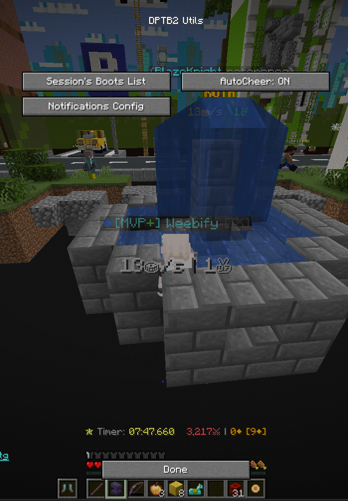

# DPTB2 Utils
An utility mod for the Hypixel Housing game **Don't Press The Button 2**

### Current supported versions:
- Fabric 1.21.4
- Fabric 1.21.7
- Fabric 1.20.4

# Features
- **AutoCheer**: Automatically cheers when a community goal is reached.
- **Micro-event Notifications**: Notifies you when these events happen:
    - Shop Update: Rotating Shop reset.
    - Boots Acquisition: Someone got a rare boots with the announcement in chat.
    - City Door Switch: When City's random door switches.
    - Button Mayhem: No button cooldown for 10s.
    - Button Disabled: Button is disabled for 5s.
    - Button Immunity: Next person to press the button will not die.
- **Boots Tracker**: Tracks the boots players have acquired in your current session.
- More coming soon...

# Usage:
Run `/dptb2` in the chat to open the mod menu.



# Installation
### Pre-built package
You can find and download the latest stable release [here](https://github.com/Weebifying/dptb2-utils-fabric/releases/latest).

### Building from source
You can build the mod from source by cloning this repository and running the following command:
```bash
./gradlew build
```
The built mod will be located in `build/libs/` directory.